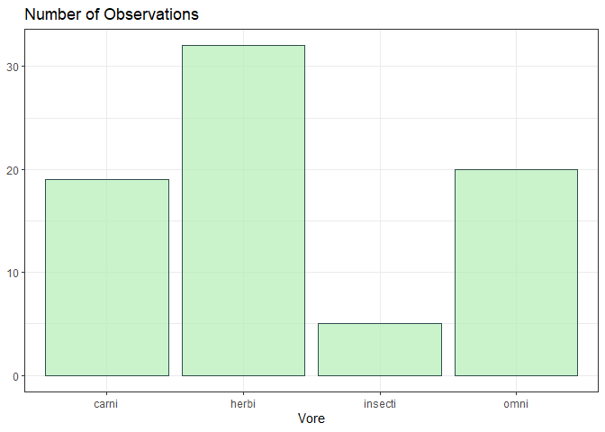
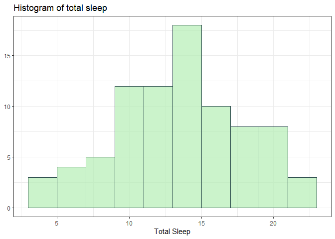
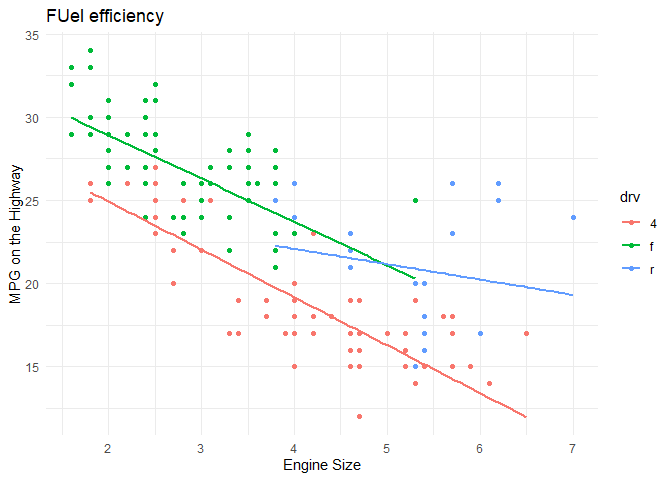
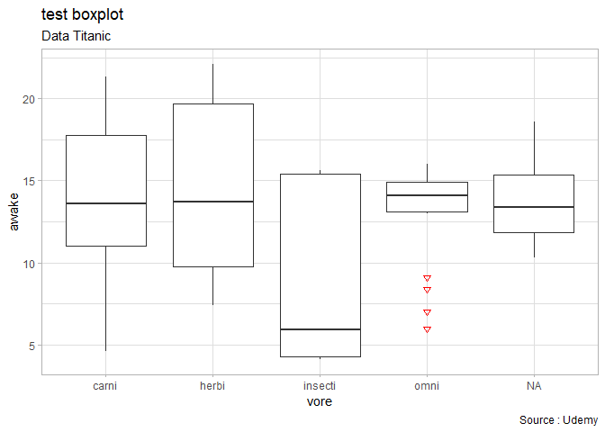
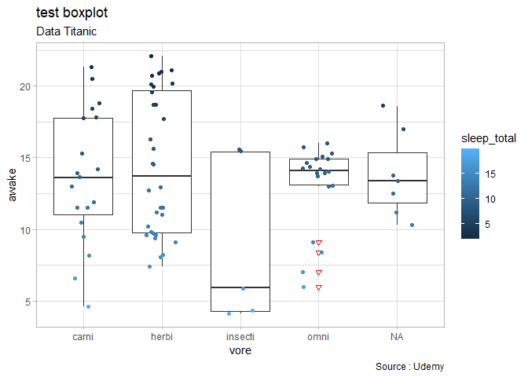
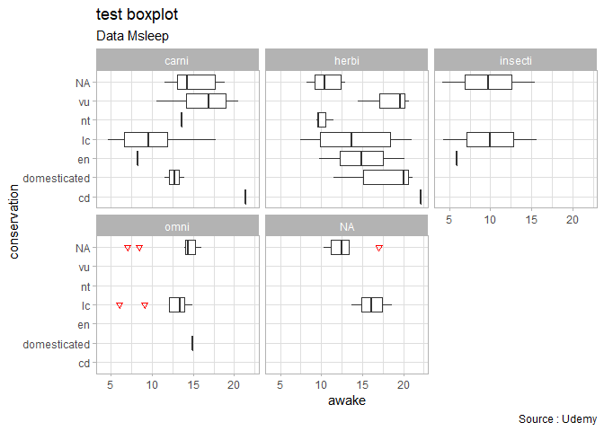
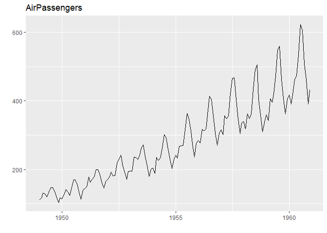
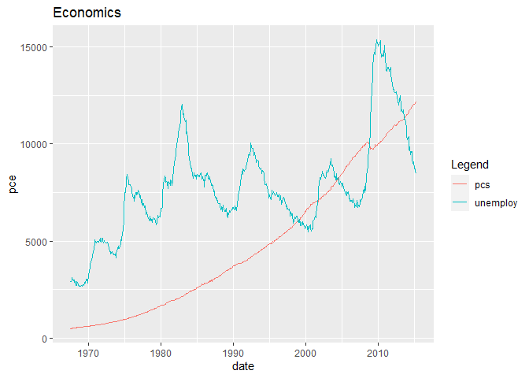

```r
library(tidyverse)
```

```
## -- Attaching packages --------------------------------------- tidyverse 1.3.0 --
```

```
## v ggplot2 3.3.3     v purrr   0.3.4
## v tibble  3.1.0     v dplyr   1.0.5
## v tidyr   1.1.3     v stringr 1.4.0
## v readr   1.4.0     v forcats 0.5.1
```

```
## Warning: package 'tibble' was built under R version 4.0.4
```

```
## -- Conflicts ------------------------------------------ tidyverse_conflicts() --
## x dplyr::filter() masks stats::filter()
## x dplyr::lag()    masks stats::lag()
```

```r
data() # to see the list of dataset available
view(msleep)
names(msleep)
```

```
##  [1] "name"         "genus"        "vore"         "order"        "conservation"
##  [6] "sleep_total"  "sleep_rem"    "sleep_cycle"  "awake"        "brainwt"     
## [11] "bodywt"
```


```r
# Bar Charts
msleep   %>%
  drop_na(vore)  %>%
  ggplot(aes(x = vore)) +
  geom_bar(color = "darkslategray", fill = "darkseagreen2", alpha = 0.7) +
  #coord_flip() +
  theme_bw()  +
  labs(x = "Vore",
       y = NULL,
       title = "Number of Observations")
```

<!-- -->

```r
#Histogram one variable
head(msleep)
```

```
## # A tibble: 6 x 11
##   name    genus vore  order conservation sleep_total sleep_rem sleep_cycle awake
##   <chr>   <chr> <chr> <chr> <chr>              <dbl>     <dbl>       <dbl> <dbl>
## 1 Cheetah Acin~ carni Carn~ lc                  12.1      NA        NA      11.9
## 2 Owl mo~ Aotus omni  Prim~ <NA>                17         1.8      NA       7  
## 3 Mounta~ Aplo~ herbi Rode~ nt                  14.4       2.4      NA       9.6
## 4 Greate~ Blar~ omni  Sori~ lc                  14.9       2.3       0.133   9.1
## 5 Cow     Bos   herbi Arti~ domesticated         4         0.7       0.667  20  
## 6 Three-~ Brad~ herbi Pilo~ <NA>                14.4       2.2       0.767   9.6
## # ... with 2 more variables: brainwt <dbl>, bodywt <dbl>
```

```r
msleep   %>%
  ggplot(aes(awake)) +
  geom_histogram(binwidth = 2, color = "darkslategray",
                      fill = "darkseagreen2", alpha = 0.7) +
  theme_bw() +
  labs(x = "Total Sleep",
       y = NULL,
       title = "Histogram of total sleep")
```

<!-- -->

```r
#Scatter plots with multiple variable
head(mpg)
```

```
## # A tibble: 6 x 11
##   manufacturer model displ  year   cyl trans      drv     cty   hwy fl    class 
##   <chr>        <chr> <dbl> <int> <int> <chr>      <chr> <int> <int> <chr> <chr> 
## 1 audi         a4      1.8  1999     4 auto(l5)   f        18    29 p     compa~
## 2 audi         a4      1.8  1999     4 manual(m5) f        21    29 p     compa~
## 3 audi         a4      2    2008     4 manual(m6) f        20    31 p     compa~
## 4 audi         a4      2    2008     4 auto(av)   f        21    30 p     compa~
## 5 audi         a4      2.8  1999     6 auto(l5)   f        16    26 p     compa~
## 6 audi         a4      2.8  1999     6 manual(m5) f        18    26 p     compa~
```

```r
mpg  %>%
  filter(hwy < 35)  %>%
  ggplot(aes(x = displ,
             y = hwy,
             colour = drv)) +
  geom_point() +
  geom_smooth(method = lm, #linear models
              se = F) + #standard error
  labs(x = "Engine Size",
       y = "MPG on the Highway",
       title = "FUel efficiency") +
  theme_minimal() +
  ggsave("scatterplot.jpg")
```

```
## Saving 7 x 5 in image
```

```
## `geom_smooth()` using formula 'y ~ x'
## `geom_smooth()` using formula 'y ~ x'
```

<!-- -->

```r
  #stat_density2d() +   #density contour
```


```r
#creating a box plot

msleep  %>%
  ggplot(aes(x=vore, y=awake)) +
  geom_boxplot(outlier.colour = "red", outlier.shape = 6) +
  labs(title="test boxplot",
       subtitle = "Data Titanic", caption="Source : Udemy") +
  theme_light()
```

<!-- -->

```r
#+ Geomjitter
msleep  %>%
  ggplot(aes(x=vore, y=awake)) +
  geom_boxplot(outlier.colour = "red", outlier.shape = 6) +
  labs(title="test boxplot",
       subtitle = "Data Titanic", caption="Source : Udemy") +
  theme_light()+
  geom_jitter(width = 0.2, aes(color = sleep_total))
```

<!-- -->

```r
# +facewrap
msleep  %>%
  ggplot(aes(x=conservation, y=awake)) +
  geom_boxplot(outlier.colour = "red", outlier.shape = 6) +
  labs(title="test boxplot",
       subtitle = "Data Msleep", caption="Source : Udemy") +
  theme_light()+
  #geom_jitter(width = 0.2, aes(color = sleep_total)) +
  facet_wrap(~vore) +#dont forget to put ~
  coord_flip() +
  ggsave("boxplot.jpg")
```

```
## Saving 7 x 5 in image
```

<!-- -->


```r
#To save the file
#+ ggsave(filename, path)
```

```r
#timeseries
#Make a time series plot (using ggfortify)
library(ggfortify)
autoplot(AirPassengers) + labs(title="AirPassengers")  # where AirPassengers is a 'ts' object
```

<!-- -->

```r
class(AirPassengers)
```

```
## [1] "ts"
```

```r
# Approach 2 uaing ggplot only
data(economics, package="ggplot2")  # init data
economics <- data.frame(economics)  # convert to dataframe
ggplot(economics) + geom_line(aes(x=date, y=pce, color="pcs")) + geom_line(aes(x=date, y=unemploy, col="unemploy")) + scale_color_discrete(name="Legend") + labs(title="Economics") # plot multiple time series using 'geom_line's
```

<!-- -->

